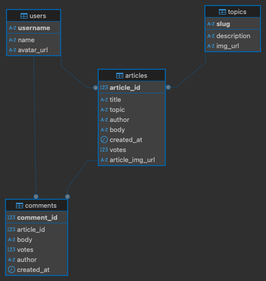

# Headless Press API

[🚀 hosted on Render.com](https://headless-press-api.onrender.com/)
A RESTful API built to serve a news aggregation and discussion platform. This project handles data for topics, articles, comments, and users, providing a robust backend for a full-stack application.

The project was built using **Node.js**, **Express**, and **PostgreSQL**.

## Tech Stack

- **Runtime:** Node.js (v20+)
- **Server Framework:** Express.js
- **Database:** PostgreSQL
- **Testing:** Jest and Supertest
- **Version Control:** Git

## Local Setup

### 1. Clone the repository

```bash
git clone [https://github.com/vertigo1919/headless-press-api.git](https://github.com/vertigo1919/headless-press-api.git)
cd headless-press-api

```

### 2. Install dependencies

```bash
npm install

```

### 3. Environment Variables

You will need two environment files in the root directory to manage the different databases:

- Create a file named `.env.test` and add: `PGDATABASE=nc_news_test`
- Create a file named `.env.development` and add: `PGDATABASE=nc_news`

### 4. Database Initialization

Run the following scripts to create the databases and seed them with the provided data:

```bash
# Create the databases
npm run setup-dbs

# Seed the development database
npm run seed

```

## Running the Project

### Tests

The project uses **Test-Driven Development (TDD)**. To run the test suite:

```bash
npm test

```

### Start the Server

To run the API locally on your machine:

```bash
npm start

```

## API Endpoints

Once the server is running, you can visit `http://localhost:9090/api` to see a full list of available endpoints.

| Method   | Endpoint                             | Description                                             |
| -------- | ------------------------------------ | ------------------------------------------------------- |
| `GET`    | `/api/topics`                        | Returns all topics                                      |
| `GET`    | `/api/articles`                      | Returns articles with support for sorting and filtering |
| `GET`    | `/api/articles/:article_id`          | Returns a specific article by its ID                    |
| `PATCH`  | `/api/articles/:article_id`          | Updates the vote count on an article                    |
| `GET`    | `/api/articles/:article_id/comments` | Returns all comments for an article                     |
| `POST`   | `/api/articles/:article_id/comments` | Adds a new comment to an article                        |
| `DELETE` | `/api/comments/:comment_id`          | Removes a comment by its ID                             |

---

## Database Schema


