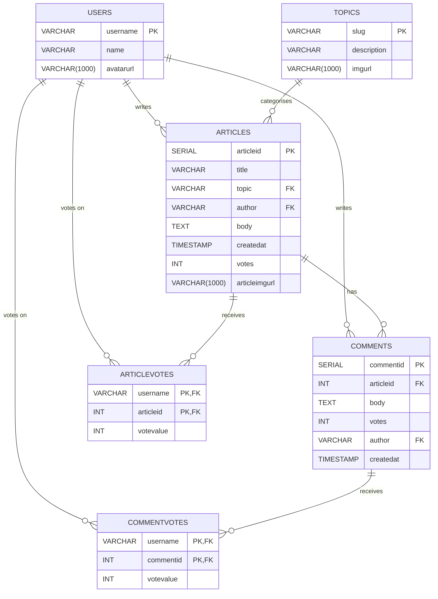

# Headless Press API

A RESTful API built to serve a news aggregation and discussion platform. This project handles data for topics, articles, comments, and users, providing a robust backend for a full-stack application. This API powers [**PressIt**](https://github.com/vertigo1919/pressit), a minimalist Reddit-style news client built with React.

- [🚀 Headless Press API - Live Demo](https://headless-press-api.onrender.com/)
- [📰 PressIt - Frontend Repo](https://github.com/vertigo1919/pressit)
- [🌐 Pressit - Frontend Live Demo](https://pressit-app.netlify.app/)

## Tech Stack

- **Runtime:** Node.js (v20+)
- **Server Framework:** Express.js
- **Database:** PostgreSQL (hosted on Supabase)
- **Hosting:** Render.com (Node/Express API)
- **Monitoring / Uptime:** Better Stack (scheduled pings to `/ping`)
- **Testing:** Jest and Supertest

## Local Setup

### 1. Clone the repository

```bash
git clone https://github.com/vertigo1919/headless-press-api.git
cd headless-press-api
```

### 2. Install dependencies

```bash
npm install

```

### 3. Environment Variables

You will need two environment files in the root directory to manage the different databases:

- Create a file named `.env.test` and add: `PGDATABASE=nc_news_test`
- Create a file named `.env.development` and add: `PGDATABASE=nc_news`

### 4. Database Initialization

Run the following scripts to create the databases and seed them with the provided data:

```bash
# Create the databases
npm run setup-dbs

# Seed the development database
npm run seed

```

## Running the Project

### Tests

The project was created using **Test-Driven Development (TDD)**. To run the test suite:

```bash
npm test

```

### Start the Server

To run the API locally on your machine:

```bash
npm start

```

The server will start on `http://localhost:9090` by default.

## API Endpoints

Once the server is running, you can visit:

- Local: `http://localhost:9090/api`
- Live: `https://headless-press-api.onrender.com/api`

for a full list of available endpoints.

| Method   | Endpoint                             | Description                                             |
| -------- | ------------------------------------ | ------------------------------------------------------- |
| `GET`    | `/api/topics`                        | Returns all topics                                      |
| `GET`    | `/api/articles`                      | Returns articles with support for sorting and filtering |
| `GET`    | `/api/articles/:article_id`          | Returns a specific article by its ID                    |
| `PATCH`  | `/api/articles/:article_id`          | Updates the vote count on an article                    |
| `GET`    | `/api/articles/:article_id/comments` | Returns all comments for an article                     |
| `POST`   | `/api/articles/:article_id/comments` | Adds a new comment to an article                        |
| `DELETE` | `/api/comments/:comment_id`          | Removes a comment by its ID                             |
| `GET`    | `/ping`                              | Lightweight health check used for uptime pings          |

---

## Keep-Alive `/ping` Route

To reduce cold starts on the free tiers of Render and Supabase, this project exposes a lightweight health-check endpoint:

```http
GET /ping
```

**Behavior:**

- Runs a trivial database query (`SELECT 1 AS awake`) to keep the PostgreSQL connection and Render service warm.
- Can be pinged by an external uptime/cron service (e.g. Better Stack) every few minutes.

**Rationale:**

On free hosting tiers, inactive services may be paused or put to sleep after periods of inactivity.  
By periodically calling `/ping`, the API and database stay responsive, reducing the delay for the first real user request after inactivity.

---

## Database Schema


```mermaid
erDiagram
  USERS {
    VARCHAR username PK
    VARCHAR name
    VARCHAR(1000) avatarurl
  }

  TOPICS {
    VARCHAR slug PK
    VARCHAR description
    VARCHAR(1000) imgurl
  }

  ARTICLES {
    SERIAL articleid PK
    VARCHAR title
    VARCHAR topic FK
    VARCHAR author FK
    TEXT body
    TIMESTAMP createdat
    INT votes
    VARCHAR(1000) articleimgurl
  }

  COMMENTS {
    SERIAL commentid PK
    INT articleid FK
    TEXT body
    INT votes
    VARCHAR author FK
    TIMESTAMP createdat
  }

  ARTICLEVOTES {
    VARCHAR username PK, FK
    INT articleid PK, FK
    INT votevalue
  }

  COMMENTVOTES {
    VARCHAR username PK, FK
    INT commentid PK, FK
    INT votevalue
  }

  USERS ||--o{ ARTICLES : "writes"
  USERS ||--o{ COMMENTS : "writes"
  USERS ||--o{ ARTICLEVOTES : "votes on"
  USERS ||--o{ COMMENTVOTES : "votes on"

  TOPICS ||--o{ ARTICLES : "categorises"

  ARTICLES ||--o{ COMMENTS : "has"
  ARTICLES ||--o{ ARTICLEVOTES : "receives"
  COMMENTS ||--o{ COMMENTVOTES : "receives"

```
